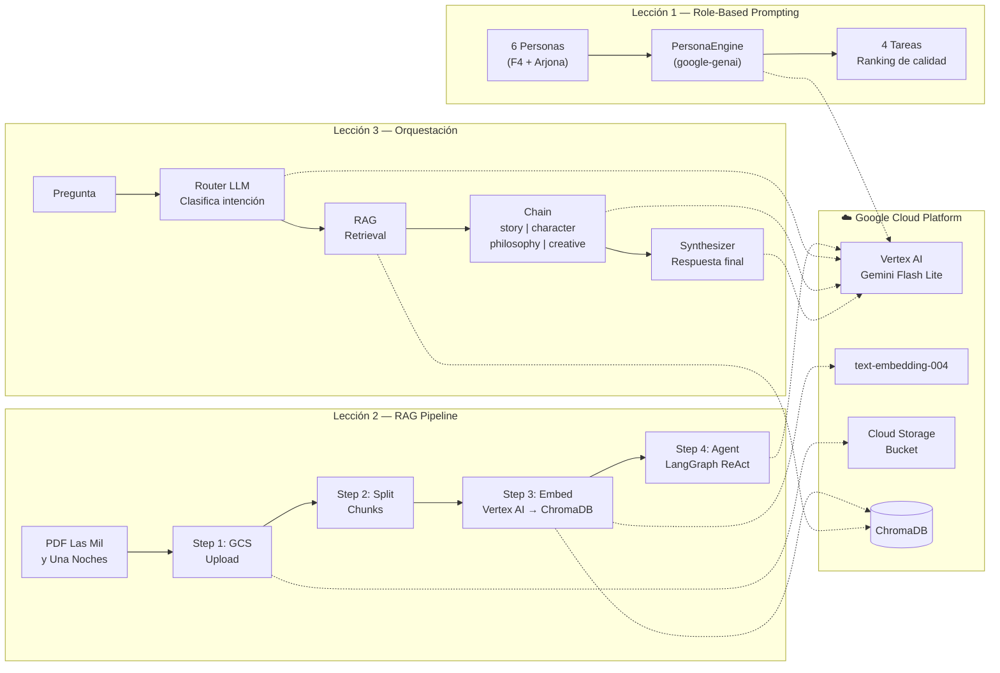

# Módulo 03 — Vertex AI: LLMs, RAG y Orquestación con Google Cloud

Módulo práctico del curso **Cloud AI-Centric** que demuestra cómo construir
aplicaciones de IA generativa de producción usando Google Cloud Platform.

---

## ⚡ Quick Start

```bash
cd modulo_03_gcp
uv sync
uv run verify_setup.py        # verifica que GCP está listo
uv run 01_role_base.py         # lección 1 — role prompting (~5 min)
uv run 02_rag_pipeline.py      # lección 2 — RAG pipeline (~3 min)
uv run 03_orchestration.py     # lección 3 — orquestación (~2 min)
```

---

## Conceptos clave — antes de empezar

Si eres nuevo en IA generativa, estos conceptos son la base de todo lo que hace este módulo.
Léelos una vez y el código te parecerá mucho más claro.

### ¿Qué es RAG? (Retrieval-Augmented Generation)

Un LLM sabe mucho sobre el mundo en general, pero **no conoce tu libro** (ni tu base de datos,
ni tus documentos internos). Sin RAG, si le preguntas "¿qué dice la página 47 de Las Mil y Una
Noches?", el modelo inventará una respuesta plausible — no la real.

**RAG resuelve esto en 2 pasos:**

```
1. RETRIEVE (recuperar): busca en tu documento los fragmentos más relevantes para la pregunta
2. GENERATE (generar):  le das esos fragmentos al LLM como contexto → responde con datos reales
```

Es la diferencia entre un estudiante que adivina la respuesta y uno que primero busca en el libro.

---

### ¿Qué son los embeddings vectoriales?

Un embedding es la forma en que convertimos texto en números para que la computadora pueda
comparar significados — no solo palabras iguales, sino ideas similares.

```
"Scheherazade cuenta historias" → [0.23, -0.81, 0.44, 0.17, ...]  (768 números)
"La narradora relata cuentos"   → [0.21, -0.79, 0.46, 0.19, ...]  (muy parecidos!)
"El gato toma café"             → [-0.54, 0.32, -0.11, 0.88, ...]  (muy diferentes)
```

El modelo `text-embedding-004` de Vertex AI convierte cada fragmento del libro en 768 números.
Cuando llega una pregunta, también la convierte a 768 números y busca los fragmentos **más
cercanos** en ese espacio matemático. Eso es búsqueda semántica.

---

### ¿Qué es ChromaDB?

**ChromaDB es una base de datos vectorial** — almacena embeddings y permite búsquedas semánticas
ultrarrápidas. Es como una base de datos normal (SQL), pero en vez de buscar por texto exacto,
busca por *similitud de significado*.

```
Base de datos SQL:       SELECT * WHERE texto = 'Scheherazade'   → solo coincidencias exactas
ChromaDB (vectorial):    busca('¿quién cuenta historias?')        → encuentra fragmentos sobre
                                                                     Scheherazade aunque no
                                                                     la mencionen por nombre
```

En este módulo, la Lección 2 construye el ChromaDB: lee el PDF → divide en fragmentos → genera
embeddings con Vertex AI → guarda todo en `data/chroma_db/`. La Lección 3 lo usa para hacer
búsquedas semánticas dentro del pipeline de orquestación.

---

### ¿Qué es la Orquestación con cadenas LangChain?

La **orquestación** es el patrón de conectar múltiples componentes de IA en un flujo estructurado.
En vez de hacer una sola llamada al LLM, se encadenan varios pasos especializados:

- Un **Router** clasifica la intención de la pregunta (¿es narrativa? ¿filosófica? ¿creativa?)
- Un **Retriever** busca los fragmentos relevantes del corpus con RAG
- Una **Cadena especializada** analiza según el tipo de pregunta (cada cadena tiene su propio prompt)
- Un **Sintetizador** integra todo en una respuesta final coherente

Esto es más poderoso que una sola llamada al LLM porque cada componente está optimizado para
su tarea específica, con prompts dedicados y parámetros ajustados.

---

### ¿Qué es Vertex AI?

**Vertex AI** es la plataforma de IA de Google Cloud. En este módulo usamos dos servicios:

| Servicio | Para qué lo usamos | Costo aproximado |
|----------|-------------------|-----------------|
| **Gemini Flash Lite** (LLM) | Generar texto — análisis, poemas, síntesis | ~$0.001 / 1000 tokens |
| **text-embedding-004** | Convertir fragmentos del libro a vectores | ~$0.00002 / 1000 tokens |

Con los $300 de créditos gratuitos de GCP puedes correr el demo **miles de veces** sin pagar nada.

---

## Arquitectura general



---

## Objetivos

| Lección | Concepto | Tecnología |
|---------|----------|-----------|
| `01_role_base.py` | Role-Based Prompting | `google-genai` + Vertex AI Gemini |
| `02_rag_pipeline.py` | RAG Pipeline (4 pasos) | GCS + ChromaDB + LangChain |
| `03_orchestration.py` | Orquestación profunda | LangGraph + Chaining + Routing |

---

## Requisitos previos

- Python **3.11 o superior**
- Cuenta de **Google Cloud Platform** con proyecto activo
- Acceso a **Vertex AI** habilitado en el proyecto

---

## Instalación — Mac / Linux

### 1. Instalar `uv`

```bash
curl -LsSf https://astral.sh/uv/install.sh | sh

# Recargar el PATH (o reiniciar la terminal)
source $HOME/.local/bin/env

# Verificar
uv --version
```

### 2. Instalar Google Cloud CLI

```bash
# Mac con Homebrew (recomendado)
brew install --cask google-cloud-sdk

# Linux / Mac sin Homebrew
curl https://sdk.cloud.google.com | bash
exec -l $SHELL

# Verificar
gcloud --version
```

### 3. Autenticar con GCP

```bash
gcloud auth login
gcloud auth application-default login
gcloud config set project mlops-practices-wb
```

### 4. Instalar dependencias del módulo

```bash
cd modulo_03_gcp
uv sync
```

### 5. Verificar instalación

```bash
uv run python --version
uv run python -c "from shared.logger import get_logger; print('shared OK')"
uv run python -c "import google.genai; print('google-genai OK')"
uv run python -c "from langchain_google_vertexai import ChatVertexAI; print('langchain OK')"
```

---

## Instalación — Windows (PowerShell)

### 1. Instalar `uv`

Abre **PowerShell** y ejecuta:

```powershell
powershell -ExecutionPolicy ByPass -c "irm https://astral.sh/uv/install.ps1 | iex"
```

> Cierra y vuelve a abrir PowerShell. Verifica con `uv --version`.

### 2. Instalar Google Cloud CLI

**Opción A — Instalador visual (recomendado):**

1. Descarga el instalador desde:
   ```
   https://dl.google.com/dl/cloudsdk/channels/rapid/GoogleCloudSDKInstaller.exe
   ```
2. Ejecuta el `.exe` con las opciones por defecto.
3. Asegúrate de que **"Add gcloud to PATH"** esté marcado.
4. Al finalizar, deja marcado **"Run gcloud init"** y presiona **Finish**.

**Opción B — winget:**

```powershell
winget install Google.CloudSDK
```

> En ambos casos: **cierra y vuelve a abrir PowerShell** para que el PATH se actualice.

```powershell
# Verificar
gcloud --version
```

### 3. Autenticar con GCP

```powershell
gcloud auth login
# Se abre el navegador → inicia sesión con tu cuenta Google

gcloud auth application-default login
# Se abre el navegador nuevamente → acepta los permisos

gcloud config set project mlops-practices-wb
```

### 4. Instalar dependencias del módulo

```powershell
cd "C:\ruta\a\Cloud_AI_Centric_Course\modulo_03_gcp"
uv sync
```

### 5. Verificar instalación

```powershell
uv run python --version
uv run python -c "from shared.logger import get_logger; print('shared OK')"
uv run python -c "import google.genai; print('google-genai OK')"
uv run python -c "from langchain_google_vertexai import ChatVertexAI; print('langchain OK')"
```

---

## Variables de entorno

Edita el archivo `src/.env` con tus valores:

```env
PROJECT_ID=mlops-practices-wb
LOCATION=us-central1
GCP_API_KEY=<tu-api-key>
```

> El archivo `.env` ya existe en el repositorio con los valores del proyecto.
> Si trabajas con un proyecto GCP propio, cambia `PROJECT_ID`.

---

## Ejecución

> **Todos los comandos se ejecutan desde la carpeta `modulo_03_gcp/`**

### Lección 1 — Role-Based Prompting

```bash
# Mac / Linux
uv run 01_role_base.py

# Windows
uv run 01_role_base.py
```

Ejecuta los **4 TODOs** con los **6 personajes** (6 × 4 = 24 llamadas a la API):

| TODO | Tarea |
|------|-------|
| 1 | Análisis de fortalezas y debilidades (con canon Marvel) |
| 2 | Villain matchup — rival natural por personaje |
| 3 | Canción estilo Ricardo Arjona para la batalla épica |
| 4 | Escenarios de batalla en América Latina |

**Personas:**
- Reed Richards — Mr. Fantástico
- Ben Grimm — La Cosa
- Johnny Storm — La Antorcha Humana
- Sue Storm — Mujer Invisible
- Ricardo Arjona
- Mix (síntesis de los 5)

**Duración estimada:** 3–5 minutos

---

### Lección 2 — RAG Pipeline

```bash
uv run 02_rag_pipeline.py
```

```
STEP 1 — Ingest  : Sube el PDF a GCS  →  gs://<bucket>/modulo_03_rag/
STEP 2 — Split   : Divide en chunks   →  1 000 chars, 200 overlap
STEP 3 — Embed   : Vertex AI embeddings → ChromaDB local + sync a GCS
STEP 4 — Agent   : Agente LangGraph ReAct responde 4 preguntas demo
```

**Notas:**
- `config.yaml → rag.max_pages: 150` limita el índice para demos rápidos.
  Para indexar el libro completo (4 865 páginas, ~16 min) pon `max_pages: 0`.
- Idempotente: si el PDF ya está en GCS y ChromaDB ya tiene vectores, los pasos se omiten.
- Con `sync_chroma_gcs: true` el índice vectorial queda visible en GCS Console.

**Duración estimada (demo):** 2–3 minutos

---

### Lección 3 — Orquestación Profunda

```bash
# Requiere haber ejecutado la Lección 2 primero
uv run 03_orchestration.py
```

```
Pregunta
  └─► [Router LLM]    → clasifica: story | character | philosophy | creative
       └─► [RAG]       → recupera top-5 fragmentos del corpus
            └─► [Chain] → análisis especializado según la ruta
                 └─► [Synthesizer] → integra en respuesta final enriquecida
```

| Ruta | Cadena | Descripción |
|------|--------|-------------|
| `story` | Narrativo | Arco, elementos fantásticos, cuentos anidados |
| `character` | Personajes | Arquetipo, motivaciones, dinámica de poder |
| `philosophy` | Filosófico | Moral, pensamiento islámico, vigencia actual |
| `creative` | Creativo | Poemas, monólogos, adaptaciones |

**Duración estimada:** 1–2 minutos

---

## Arquitectura del módulo

```
modulo_03_gcp/
├── 01_role_base.py          ← Launcher Lección 1
├── 02_rag_pipeline.py       ← Launcher Lección 2
├── 03_orchestration.py      ← Launcher Lección 3
├── config.yaml              ← Configuración central (modelo, RAG, GCS sync)
├── pyproject.toml           ← Dependencias Python
│
└── src/
    ├── .env                 ← PROJECT_ID, GCP_API_KEY, LOCATION
    ├── database/
    │   └── Anónimo Las Mil y Una Noches.pdf   ← Corpus RAG
    │
    ├── shared/              ← Logger Rich + ConfigLoader
    │   ├── logger.py
    │   └── config_loader.py
    │
    ├── 01_role_base/        ← Role-Based Prompting
    │   ├── personas.py      ← 6 personas definidas
    │   ├── tasks.py         ← 4 tareas temáticas
    │   ├── engine.py        ← PersonaEngine + métricas
    │   └── main.py
    │
    ├── 02_rag/              ← Pipeline RAG (4 pasos)
    │   ├── step1_ingest.py  ← GCS upload
    │   ├── step2_split.py   ← PDF → chunks
    │   ├── step3_embed.py   ← Embeddings + ChromaDB + sync GCS
    │   ├── step4_agent.py   ← Agente LangGraph ReAct
    │   └── main.py
    │
    └── 03_orchestration/    ← Orquestación profunda
        ├── prompts.py       ← Plantillas especializadas
        ├── chains.py        ← LangChain chains
        ├── router.py        ← LLM router dinámico
        ├── graph.py         ← Grafo LangGraph
        └── main.py
```

---

## Configuración (`config.yaml`)

```yaml
model:
  name: gemini-2.5-flash-lite   # Más rápido y económico
  thinking_budget: 0             # 0 = sin razonamiento interno (más rápido)
  temperature: 0.3
  max_output_tokens: 5000

embedding:
  model: text-embedding-004

rag:
  bucket: mlops-practices-wb-cap2-end_to_end
  bucket_prefix: modulo_03_rag/
  chunk_size: 1000
  chunk_overlap: 200
  top_k: 5
  max_pages: 150              # 0 = libro completo (~16 min)
  sync_chroma_gcs: true       # Sincroniza ChromaDB a GCS
  chroma_gcs_prefix: modulo_03_rag/chroma_db/
```

### Opciones de modelo

| Modelo | Velocidad | Calidad | `thinking_budget` |
|--------|-----------|---------|-------------------|
| `gemini-2.5-flash-lite` | ★★★ | ★★ | `0` |
| `gemini-2.5-flash` | ★★ | ★★★ | `0` |
| `gemini-2.5-pro` | ★ | ★★★★ | `>= 1024` (obligatorio) |

---

## ¿Dónde ver la base vectorial en GCP?

Después de ejecutar la Lección 2 con `sync_chroma_gcs: true`, los archivos del índice
vectorial (ChromaDB) quedan disponibles en Google Cloud Storage:

**GCS Console:**
```
https://console.cloud.google.com/storage/browser/mlops-practices-wb-cap2-end_to_end
```

Navega a: `modulo_03_rag/chroma_db/`

Allí encontrarás:
- `chroma.sqlite3` — metadatos y colecciones
- `<uuid>/data_level0.bin` — vectores del índice HNSW
- `<uuid>/header.bin`, `length.bin`, `link_lists.bin` — estructura del índice

El PDF fuente está en la misma bucket: `modulo_03_rag/`

> Para un vector store nativo de GCP a escala de producción, considera
> **Vertex AI Vector Search** (Matching Engine), visible en Vertex AI Console → Vector Search.

---

## Solución de problemas

| Error | Causa | Solución |
|-------|-------|----------|
| `gcloud: command not found` | gcloud no instalado | Instala Google Cloud SDK y reinicia la terminal |
| `uv: command not found` | uv no instalado | Instala uv y reinicia la terminal |
| `PERMISSION_DENIED` en GCP | Credenciales expiradas | Ejecuta `gcloud auth application-default login` |
| `PROJECT_ID not set` | `.env` incompleto | Verifica `src/.env` con `PROJECT_ID=mlops-practices-wb` |
| `ModuleNotFoundError: shared` | Entorno no instalado | Ejecuta `uv sync` dentro de `modulo_03_gcp/` |
| `400 thinking_budget` | Modelo incorrecto | `gemini-2.5-pro` requiere `thinking_budget >= 1024` en `config.yaml` |
| `404 model not found` | Nombre de modelo incorrecto | Usa `gemini-2.5-flash-lite`, `gemini-2.5-flash` o `gemini-2.5-pro` |
| `ChromaDB not found` | Lección 2 no ejecutada | Ejecuta `uv run 02_rag_pipeline.py` antes de la Lección 3 |
| Error en Windows con rutas | Espacios en el path | Usa comillas: `cd "C:\ruta con espacios\modulo_03_gcp"` |

---

## Referencias

- [Vertex AI Generative AI](https://cloud.google.com/vertex-ai/generative-ai/docs)
- [google-genai SDK](https://googleapis.github.io/python-genai/)
- [LangChain Google Vertex AI](https://python.langchain.com/docs/integrations/chat/google_vertex_ai_palm/)
- [LangGraph](https://langchain-ai.github.io/langgraph/)
- [ChromaDB](https://docs.trychroma.com/)
- [Instalar Google Cloud CLI — Windows](https://cloud.google.com/sdk/docs/install#windows)
- [Instalar Google Cloud CLI — Mac/Linux](https://cloud.google.com/sdk/docs/install#linux)
- [Instalar uv](https://docs.astral.sh/uv/getting-started/installation/)
