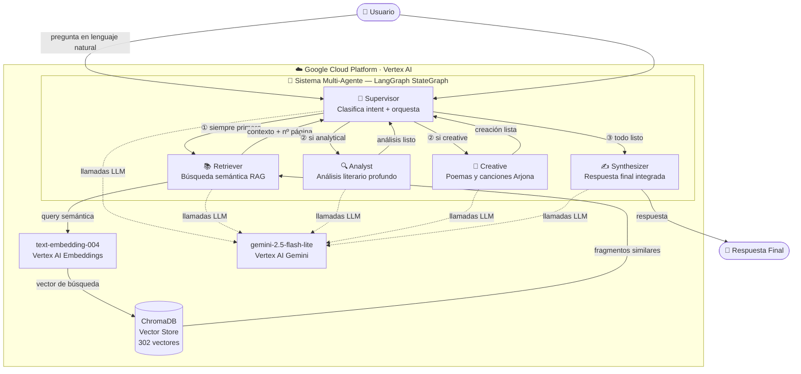

# Módulo 04 — Sistema Multi-Agente con LangGraph y Vertex AI

## ⚡ Quick Start (ya tienes cuenta GCP y todo instalado)

```bash
# 0. PRIMERO — construye el índice vectorial (solo una vez por máquina)
cd modulo_03_gcp && uv sync && uv run 02_rag_pipeline.py
cd ../modulo_04_langgraph_gcp

# 1. Instala dependencias
uv sync

# 2. Verifica entorno (11 checks automáticos)
uv run verify_setup.py

# 3. Demo completo — 3 preguntas, 3 flujos (~50 segundos)
uv run run_demo.py

# 4. Tu propia pregunta
uv run run_demo.py --query "¿Quién era Scheherazade?"
```

> **⚠️ Importante:** El índice vectorial (`data/chroma_db/`) está en `.gitignore` porque es
> un archivo binario de ~5 MB generado localmente. Al clonar el repo o en una máquina nueva
> siempre necesitas ejecutar el **paso 0** primero (~3 minutos, solo la primera vez).

> Si es tu primera vez con GCP, lee la **PARTE 1** antes de continuar.

---

**"El Guardián de Las Mil y Una Noches"**: un sistema de inteligencia artificial donde
cinco agentes especializados colaboran en tiempo real para analizar y crear contenido
sobre la obra literaria árabe más icónica de la historia.

> **Resultado probado y funcionando** — 3 queries ejecutadas, 3 flujos diferentes,
> respuestas de alta calidad con fragmentos reales del libro.

---

## ¿Qué vas a aprender?

Al terminar este módulo serás capaz de:

- Explicar qué es un sistema multi-agente y por qué es más poderoso que un solo LLM
- Diseñar un grafo de agentes con **LangGraph** (StateGraph, nodos, edges condicionales)
- Implementar el patrón **Supervisor + Especialistas** (hub-and-spoke)
- Conectar agentes a una base de datos vectorial (**ChromaDB + Vertex AI Embeddings**)
- Clasificar la intención de una query y enrutar dinámicamente a diferentes agentes
- Aplicar buenas prácticas: inyección de dependencias, anti-loop, estado tipado

**¿Por qué multi-agente?** Un LLM genérico es como pedirle a una sola persona que sea
al mismo tiempo bibliotecaria, profesora de literatura, poeta y directora de orquesta.
Los sistemas multi-agente dividen esas responsabilidades: cada agente es experto en su
tarea, y un orquestador decide quién trabaja en cada momento. El resultado es más preciso,
modular y extensible.

---

## Conceptos clave — antes de empezar

Si eres nuevo en IA generativa, estos conceptos son la base de todo lo que hace este módulo.
Léelos una vez y el código te parecerá mucho más claro.

### ¿Qué es RAG? (Retrieval-Augmented Generation)

Un LLM sabe mucho sobre el mundo en general, pero **no conoce tu libro** (ni tu base de datos,
ni tus documentos internos). Sin RAG, si le preguntas "¿qué dice la página 47 de Las Mil y Una
Noches?", el modelo inventará una respuesta plausible — no la real.

**RAG resuelve esto en 2 pasos:**

```
1. RETRIEVE (recuperar): busca en tu documento los fragmentos más relevantes para la pregunta
2. GENERATE (generar):  le das esos fragmentos al LLM como contexto → responde con datos reales
```

Es la diferencia entre un estudiante que adivina la respuesta y uno que primero busca en el libro.

---

### ¿Qué son los embeddings vectoriales?

Un embedding es la forma en que convertimos texto en números para que la computadora pueda
comparar significados — no solo palabras iguales, sino ideas similares.

```
"Scheherazade cuenta historias" → [0.23, -0.81, 0.44, 0.17, ...]  (768 números)
"La narradora relata cuentos"   → [0.21, -0.79, 0.46, 0.19, ...]  (muy parecidos!)
"El gato toma café"             → [-0.54, 0.32, -0.11, 0.88, ...]  (muy diferentes)
```

El modelo `text-embedding-004` de Vertex AI convierte cada fragmento del libro en 768 números.
Cuando llega una pregunta, también la convierte a 768 números y busca los fragmentos **más
cercanos** en ese espacio matemático. Eso es búsqueda semántica.

---

### ¿Qué es ChromaDB?

**ChromaDB es una base de datos vectorial** — almacena embeddings y permite búsquedas semánticas
ultrarrápidas. Es como una base de datos normal (SQL), pero en vez de buscar por texto exacto,
busca por *similitud de significado*.

```
Base de datos SQL:       SELECT * WHERE texto = 'Scheherazade'   → solo coincidencias exactas
ChromaDB (vectorial):    busca('¿quién cuenta historias?')        → encuentra fragmentos sobre
                                                                     Scheherazade aunque no
                                                                     la mencionen por nombre
```

En este módulo:
- El módulo 03 construye el ChromaDB: lee el PDF → divide en 302 fragmentos → genera embeddings
  con Vertex AI → guarda todo en `data/chroma_db/`
- El módulo 04 lo usa: abre ese ChromaDB → el Retriever Agent hace búsquedas semánticas sobre él

---

### ¿Qué es LangGraph y un StateGraph?

**LangGraph** es una librería de Python para construir aplicaciones de IA como grafos de flujo.
Un **StateGraph** es un grafo donde:

- Los **nodos** son funciones (en nuestro caso, agentes de IA)
- Los **edges** son conexiones entre nodos (flechas del diagrama)
- El **estado** es un diccionario compartido que todos los nodos pueden leer y escribir

```python
# Cada nodo recibe el estado y devuelve qué campos actualiza
def analyst_node(state: MilYUnaState) -> dict:
    analysis = llm.invoke(state["query"] + state["retrieved_context"])
    return {"analysis": analysis}   # actualiza solo este campo
```

A diferencia de una función normal que corre de arriba a abajo, un StateGraph puede:
- **Bifurcar**: ir al Analyst O al Creative según el tipo de pregunta
- **Iterar**: el Supervisor puede llamar a varios agentes en secuencia
- **Terminar**: cuando el Synthesizer termina, el grafo llega a `END`

---

### ¿Qué es Vertex AI?

**Vertex AI** es la plataforma de IA de Google Cloud. En este módulo usamos dos servicios:

| Servicio | Para qué lo usamos | Costo aproximado |
|----------|-------------------|-----------------|
| **Gemini Flash Lite** (LLM) | Generar texto — análisis, poemas, síntesis | ~$0.001 / 1000 tokens |
| **text-embedding-004** | Convertir fragmentos del libro a vectores | ~$0.00002 / 1000 tokens |

Con los $300 de créditos gratuitos de GCP puedes correr el demo **miles de veces** sin pagar nada.

---

## ¿Qué es un Sistema Multi-Agente?

Imagina que contratas a un equipo especializado para responder preguntas sobre un libro:

| Rol | Agente | Responsabilidad única |
|-----|--------|----------------------|
| 🎯 Director de orquesta | **Supervisor** | Clasifica la pregunta y decide quién trabaja |
| 📚 Bibliotecario | **Retriever** | Busca los fragmentos relevantes en ChromaDB |
| 🔍 Analista literario | **Analyst** | Interpreta y analiza con profundidad académica |
| 🎨 Poeta / Compositor | **Creative** | Genera poemas y canciones estilo Arjona |
| ✍️ Editor final | **Synthesizer** | Integra todo en una respuesta cohesiva |

¿Por qué no usar un solo LLM para todo? Porque la especialización produce mejor calidad:
el Analyst tiene un prompt académico, el Creative tiene un prompt poético, el Supervisor
tiene un prompt de clasificación. Cada agente hace UNA cosa bien.

---

## Arquitectura del sistema

El siguiente diagrama muestra todos los componentes y cómo se conectan en GCP:



### Los 3 flujos posibles

| Tipo | Ejemplo de pregunta | Agentes activados | Tiempo aprox. |
|------|--------------------|--------------------|---------------|
| `analytical` | "¿Quién es Scheherazade?" | Supervisor → Retriever → **Analyst** → Synthesizer | ~15s |
| `creative`   | "Escribe un haiku sobre Aladino" | Supervisor → Retriever → **Creative** → Synthesizer | ~6s |
| `hybrid`     | "Analiza a Shahryar y escribe un poema" | Supervisor → Retriever → **Analyst + Creative** → Synthesizer | ~25s |

### ¿Qué pasa exactamente cuando haces una pregunta?

Paso a paso, esto es lo que ocurre cuando ejecutas `run_demo.py`:

```
1. [Supervisor]   Tu pregunta llega. El LLM la clasifica: ¿analytical, creative o hybrid?

2. [Retriever]    Tu pregunta se convierte en un vector (768 números) con text-embedding-004.
                  ChromaDB busca los 5 fragmentos del libro con vectores más similares.
                  Resultado: 5 fragmentos con número de página y texto.

3. [Analyst]      (solo si analytical o hybrid)
                  Recibe la pregunta + los 5 fragmentos. El LLM genera un análisis
                  literario profundo basado en el texto real del libro.

4. [Creative]     (solo si creative o hybrid)
                  Recibe la pregunta + los fragmentos. El LLM genera contenido artístico
                  (poema, haiku, canción) inspirado en el texto.

5. [Supervisor]   Revisa que todo el trabajo necesario esté hecho.

6. [Synthesizer]  Recibe todo lo anterior y genera la respuesta final — coherente,
                  bien estructurada y adaptada al tipo de pregunta.

Total: 3-5 llamadas al LLM, 1 búsqueda en ChromaDB, 1 llamada de embeddings.
```

El **Supervisor** es el único nodo con edges condicionales — todos los demás agentes
reportan de vuelta a él. Esto permite routing dinámico sin hardcodear el flujo.

---

## Requisitos previos

- Python **3.11 o superior**
- Conexión a internet
- Cuenta de **Google Cloud** (ver paso a paso abajo — es gratis)
- Haber ejecutado `02_rag_pipeline.py` del **módulo 03** (construye el ChromaDB)

---

## PARTE 1 — Crear tu cuenta de Google Cloud desde cero

> Esta sección es para quienes nunca han usado GCP. Si ya tienes cuenta y proyecto, salta a **PARTE 2**.

### Paso 1.1 — Crear cuenta Google Cloud

1. Abre el navegador y ve a **https://cloud.google.com**
2. Haz clic en **"Empieza gratis"** / "Get started for free"
3. Inicia sesión con tu cuenta Google (Gmail). Si no tienes, créala en gmail.com primero.
4. Acepta los términos y condiciones
5. Ingresa datos de tarjeta de crédito o débito

   > **¿Por qué piden tarjeta si es gratis?**
   > Google la usa solo para verificar identidad. **No te cobran nada** durante el período
   > de prueba. Recibes **USD $300 en créditos gratuitos** válidos por 90 días. Solo
   > se cobra si actualizas manualmente a cuenta de pago (tú decides cuándo hacerlo).

6. Cuando veas la **Google Cloud Console**, estás dentro: https://console.cloud.google.com

---

### Paso 1.2 — Crear un proyecto nuevo

Un "proyecto" es como una carpeta que agrupa todos tus recursos de GCP.

1. En la parte superior izquierda, haz clic en el **selector de proyectos**
   (puede decir "My First Project" o "Seleccionar proyecto")
2. En el popup que aparece, haz clic en **"NUEVO PROYECTO"** (arriba a la derecha)
3. Llena los campos:
   - **Nombre del proyecto**: `henry-ai-curso` (sin espacios, solo letras y guiones)
   - **ID del proyecto**: se genera automáticamente (ej: `henry-ai-curso-123456`)
   - **Anota el Project ID** — lo necesitarás más adelante en el archivo `.env`
4. Haz clic en **"CREAR"** y espera unos segundos
5. Selecciona el nuevo proyecto en el selector

---

### Paso 1.3 — Habilitar la API de Vertex AI

1. En la barra de búsqueda de la consola, escribe **"Vertex AI"**
2. Selecciona **"Vertex AI"** en los resultados
3. Haz clic en **"HABILITAR API"** (Enable API)
4. Espera 1-2 minutos

   > Si aparece un mensaje sobre facturación, acéptalo. Los $300 de créditos cubren todo el curso.

---

### Paso 1.4 — Habilitar Cloud Storage API (para el módulo 03)

1. En la búsqueda escribe **"Cloud Storage"**
2. Selecciona **"Cloud Storage API"**
3. Haz clic en **"HABILITAR"**

---

### Paso 1.5 — Autenticación: qué método usar

Hay dos formas de autenticarte. Para aprender, recomendamos **ADC** (la más simple):

**Application Default Credentials (ADC) — Para desarrollo local:**
```bash
gcloud auth application-default login
```
Abre el navegador → autorizas con tu cuenta de Google → listo. Funciona automáticamente
con todas las APIs de GCP sin necesidad de configurar nada más.

**Service Account — Para producción y CI/CD:**
1. Ve a **IAM & Admin → Service Accounts** en la consola
2. Clic en **"+ CREAR CUENTA DE SERVICIO"**
3. Nombre: `vertex-ai-sa`, descripción: "Service account para Vertex AI"
4. Rol: **Vertex AI User** (agrega también **Storage Object Admin** si usas GCS)
5. Clic en **"LISTO"**
6. Clic en el service account → **"CLAVES"** → **"AGREGAR CLAVE"** → **"JSON"**
7. Descarga el `.json` y guárdalo en lugar seguro
8. Configura la variable:
   ```bash
   # Mac / Linux
   export GOOGLE_APPLICATION_CREDENTIALS="/ruta/al/archivo.json"

   # Windows PowerShell
   $env:GOOGLE_APPLICATION_CREDENTIALS = "C:\ruta\al\archivo.json"
   ```

> Para este curso usamos ADC. El Service Account es para cuando despliegues en producción.

---

## PARTE 2 — Instalar herramientas

### Python 3.11+

**Mac:**
```bash
brew install python@3.11
python3.11 --version   # debe mostrar Python 3.11.x
```

**Linux (Ubuntu / Debian):**
```bash
sudo apt update && sudo apt install python3.11 python3.11-venv python3-pip -y
python3.11 --version
```

**Windows:**
1. Descarga el instalador desde **https://www.python.org/downloads/**
2. Durante la instalación: **marca "Add Python to PATH"** (importante)
3. Verifica en PowerShell:
   ```powershell
   python --version
   ```

---

### uv — Gestor de paquetes moderno

`uv` es la herramienta que usamos en este curso. Es 10-100x más rápida que `pip`.

**Mac / Linux:**
```bash
curl -LsSf https://astral.sh/uv/install.sh | sh

# Carga el PATH (o cierra y abre la terminal)
source ~/.bashrc       # Linux
source ~/.zshrc        # Mac con zsh

uv --version           # Debe mostrar uv x.x.x
```

**Windows (PowerShell — ejecutar como administrador):**
```powershell
powershell -ExecutionPolicy ByPass -c "irm https://astral.sh/uv/install.ps1 | iex"
# Cierra y vuelve a abrir PowerShell
uv --version
```

---

### Google Cloud CLI (gcloud)

**Mac:**
```bash
brew install --cask google-cloud-sdk

# Reinicia la terminal y verifica:
gcloud --version
```

**Linux:**
```bash
curl https://sdk.cloud.google.com | bash
exec -l $SHELL          # Recarga el shell
gcloud --version
```

**Windows — Instalador visual (recomendado):**

1. Descarga el instalador desde:
   ```
   https://dl.google.com/dl/cloudsdk/channels/rapid/GoogleCloudSDKInstaller.exe
   ```
2. Ejecuta el `.exe` con las opciones **por defecto**
3. Asegúrate de que esté marcado **"Add gcloud to PATH"**
4. Al finalizar, deja marcado **"Run gcloud init"** y haz clic en **Finish**
5. **Cierra y vuelve a abrir PowerShell**
6. Verifica:
   ```powershell
   gcloud --version
   ```

> **Si después de instalar ves** `gcloud: El término no se reconoce...`
> → Cierra **completamente** PowerShell y ábrelo de nuevo. El PATH se actualiza al reiniciar.

**Windows — winget (alternativa):**
```powershell
winget install Google.CloudSDK
# Cierra y vuelve a abrir PowerShell
gcloud --version
```

---

## PARTE 3 — Autenticación y configuración

### Autenticar con tu cuenta GCP

```bash
# Autenticación básica (para usar comandos gcloud)
gcloud auth login

# Autenticación para el código Python (Application Default Credentials)
gcloud auth application-default login

# Configura tu proyecto (reemplaza con TU Project ID)
gcloud config set project TU_PROJECT_ID
```

> Ambos comandos abren el navegador para que inicies sesión con tu cuenta Google.

Verifica que todo esté correcto:
```bash
gcloud auth list          # Muestra la cuenta activa (marca con *)
gcloud config get-value project  # Muestra el proyecto configurado
```

---

### Prerequisito: construir el ChromaDB (módulo 03)

Este módulo reutiliza el índice vectorial del módulo anterior. Si aún no lo construiste:

**Mac / Linux:**
```bash
cd ../modulo_03_gcp
uv sync
uv run 02_rag_pipeline.py

# Verifica que el ChromaDB existe
ls data/chroma_db/

# Regresa al módulo 04
cd ../modulo_04_langgraph_gcp
```

**Windows:**
```powershell
cd ..\modulo_03_gcp
uv sync
uv run 02_rag_pipeline.py

# Verifica que el ChromaDB existe
dir data\chroma_db\

# Regresa al módulo 04
cd ..\modulo_04_langgraph_gcp
```

El ChromaDB contiene **302 vectores** de fragmentos del libro "Las Mil y Una Noches".

---

### Instalar dependencias del módulo 04

```bash
# Mac / Linux / Windows — desde la carpeta modulo_04_langgraph_gcp/
cd modulo_04_langgraph_gcp
uv sync
```

`uv sync` lee el `pyproject.toml` y crea un entorno virtual `.venv` con todas las
dependencias instaladas automáticamente. No necesitas `pip install` de nada.

> **Checkpoint** — verifica que funcionó:
> ```bash
> uv run python -c "import langgraph; import langchain_google_vertexai; print('OK')"
> ```
> Debes ver: `OK`

---

### Configurar el archivo `.env`

El archivo `src/.env` ya viene configurado para el proyecto del curso. Si usas tu
propio proyecto GCP, modifícalo:

```bash
# src/.env
PROJECT_ID=tu-project-id    ← Reemplaza con tu Project ID del Paso 1.2
LOCATION=us-central1         ← No cambies esto (región de Vertex AI)
GCP_API_KEY=tu-api-key       ← Solo si usas API Key en lugar de ADC
```

> **Nunca subas el `.env` a Git** — contiene credenciales privadas.

---

## PARTE 4 — Correr el sistema

### Paso 4.0 — Verificar el entorno (SIEMPRE primero)

Antes de correr el demo, verifica que todo está correcto:

```bash
# Mac / Linux / Windows
uv run verify_setup.py
```

Debes ver **11 ✅ PASS** y el mensaje "Todo listo". Si hay ❌, sigue las
instrucciones de solución que aparecen junto a cada error.

**Salida esperada:**
```
─── Verificación del Entorno — Módulo 04 ───
  ✅  PASS  Python >= 3.11
  ✅  PASS  Archivo src/.env existe
  ✅  PASS  PROJECT_ID configurado
  ✅  PASS  LOCATION configurado
  ✅  PASS  Google Cloud CLI (gcloud) instalado
  ✅  PASS  Cuenta GCP autenticada
  ✅  PASS  Application Default Credentials (ADC)
  ✅  PASS  ChromaDB existe (de modulo_03)
  ✅  PASS  Colección 'mily_una_noches' tiene vectores
  ✅  PASS  Google Auth (ADC) funciona en Python
  ✅  PASS  Vertex AI API funciona (gemini-2.5-flash-lite)

  Total: 11 ✅ PASS  |  0 ❌ FAIL

╭─────── ✅ Entorno verificado ──────╮
│ Todo listo. Puedes ejecutar:       │
│   uv run run_demo.py               │
╰────────────────────────────────────╯
```

---

### Paso 4.1 — Demo completo (3 queries predefinidas)

```bash
# Mac / Linux — desde la carpeta modulo_04_langgraph_gcp/
uv run run_demo.py
```

```powershell
# Windows PowerShell — desde la carpeta modulo_04_langgraph_gcp\
uv run run_demo.py
```

### Paso 4.2 — Tu propia pregunta

```bash
# Mac / Linux
uv run run_demo.py --query "¿Qué le sucede a Aladino con la lámpara?"

# Windows PowerShell
uv run run_demo.py --query "¿Qué le sucede a Aladino con la lámpara?"
```

Tipos de preguntas que puedes hacer:

| Tipo | Ejemplo |
|------|---------|
| `analytical` | "¿Qué simboliza la lámpara de Aladino?" |
| `creative` | "Escribe un soneto sobre Scheherazade" |
| `hybrid` | "Analiza a Alí Babá y escribe una canción sobre él" |

### Alternativa: activar el entorno virtual manualmente

```bash
# Mac / Linux
source .venv/bin/activate
python run_demo.py

# Windows
.venv\Scripts\activate
python run_demo.py
```

---

## Checkpoints de verificación por paso

Usa estos comandos para verificar que cada paso funcionó correctamente:

```bash
# ✅ Python instalado
python --version                    # debe ser 3.11 o mayor

# ✅ gcloud instalado
gcloud --version                    # debe mostrar Google Cloud SDK x.x.x

# ✅ Autenticación GCP
gcloud auth list                    # debe mostrar tu cuenta con (*)
gcloud config get-value project     # debe mostrar tu Project ID

# ✅ uv instalado
uv --version                        # debe mostrar uv x.x.x

# ✅ Dependencias instaladas
uv run python -c "import langgraph; import chromadb; print('OK')"

# ✅ ChromaDB del módulo 03 existe
ls ../modulo_03_gcp/data/chroma_db/ # debe mostrar archivos

# ✅ Todo el entorno
uv run verify_setup.py              # debe mostrar 11 ✅ PASS
```

---

## Resultado esperado

Al ejecutar correctamente, verás algo así en tu terminal (con colores Rich):

```
════════════════════ El Guardián de Las Mil y Una Noches ════════════════════
  Sistema Multi-Agente con LangGraph + Vertex AI
  Proyecto GCP : mlops-practices-wb
  Modelo       : gemini-2.5-flash-lite
  Región       : us-central1
  ChromaDB     : ../modulo_03_gcp/data/chroma_db  (colección: mily_una_noches)

[INFO] ChromaDB cargado — 302 vectores en colección 'mily_una_noches'
[INFO] Grafo multi-agente compilado exitosamente

═══  DEMO: Las Mil y Una Noches — Multi-Agent  ═══

═══════════════════════════════════════════════════════════════════
  Query 1 de 3
═══════════════════════════════════════════════════════════════════

  Pregunta: ¿Quién es Scheherazade y cuál es su importancia?

[INFO] 🎯 Supervisor evaluando estado del grafo...
[INFO]   Tipo detectado: analytical
[INFO] 📚 Retriever buscando en ChromaDB...  → 5 fragmentos
[INFO] 🔍 Analyst realizando análisis literario...
[INFO] ✍️  Synthesizer construyendo respuesta final...

  Tipo: analytical  |  Agentes: retriever → analyst  |  Tiempo: 14.8s

  Respuesta Final:
  ────────────────────────────────────────────────────────
  Scheherazade es uno de los personajes más fascinantes...
  [respuesta completa de alta calidad con citas del libro]
```

El demo ejecuta **3 queries** con flujos distintos. El tiempo total es ~50 segundos.

---

## Entendiendo el código

### Estructura de archivos

```
modulo_04_langgraph_gcp/
├── run_demo.py              ← Punto de entrada principal
├── config.yaml              ← Configuración del modelo, RAG y multi-agente
├── pyproject.toml           ← Dependencias (gestionadas con uv)
└── src/
    ├── .env                 ← Variables de entorno (PROJECT_ID, credenciales)
    ├── shared/
    │   ├── config.py        ← Carga config.yaml y .env (patrón singleton)
    │   └── logger.py        ← Logger coloreado con Rich
    ├── rag/
    │   └── store.py         ← Carga el ChromaDB de modulo_03_gcp
    ├── prompts/
    │   └── templates.py     ← Instrucciones (prompts) para cada agente
    ├── agents/
    │   ├── supervisor.py    ← Clasifica queries y decide el siguiente agente
    │   ├── retriever.py     ← Busca fragmentos relevantes en ChromaDB
    │   ├── analyst.py       ← Genera análisis literario profundo
    │   ├── creative.py      ← Genera poemas y canciones estilo Arjona
    │   └── synthesizer.py   ← Combina todo en la respuesta final
    └── graph/
        ├── state.py         ← TypedDict con estado compartido del grafo
        └── workflow.py      ← Construye y compila el StateGraph
```

### El estado compartido (`state.py`)

El estado es el "pizarrón" que todos los agentes pueden leer y escribir:

```python
class MilYUnaState(TypedDict):
    query: str              # Pregunta original (no cambia nunca)
    query_type: str         # "analytical" | "creative" | "hybrid"
    retrieved_context: str  # Fragmentos del libro (pone el Retriever)
    analysis: str           # Análisis literario (pone el Analyst)
    creative_content: str   # Poema/canción (pone el Creative)
    final_answer: str       # Respuesta final (pone el Synthesizer)
    steps_completed: list   # ["retriever", "analyst", ...]
    iteration_count: int    # Contador anti-loop
    next_agent: str         # Próximo nodo a ejecutar
```

### El mecanismo de routing del Supervisor

```
Si query_type está vacío:
  → Clasifica con LLM → ir a Retriever

Si "retriever" no está en steps_completed:
  → ir a Retriever

Si query es analytical/hybrid y "analyst" no corrió:
  → ir a Analyst

Si query es creative/hybrid y "creative" no corrió:
  → ir a Creative

Si todos los agentes necesarios ya corrieron:
  → ir a Synthesizer → END
```

---

## Cómo extender el sistema

### Agregar un nuevo agente

**Paso 1** — Crea `src/agents/mi_agente.py`:
```python
from graph.state import MilYUnaState
from shared.logger import get_logger

log = get_logger("agents.mi_agente")

def mi_agente_node(state: MilYUnaState, llm) -> dict:
    log.info("Mi Agente ejecutándose...")
    resultado = llm.invoke(f"Analiza esto: {state['query']}")
    return {
        "mi_nuevo_campo": resultado.content,
        "steps_completed": state.get("steps_completed", []) + ["mi_agente"],
    }
```

**Paso 2** — Agrega el campo en `src/graph/state.py`:
```python
mi_nuevo_campo: str   # Agrega debajo de los campos existentes
```

**Paso 3** — Registra el nodo en `src/graph/workflow.py`:
```python
from agents.mi_agente import mi_agente_node
from functools import partial

mi_agente = partial(mi_agente_node, llm=llm)
builder.add_node("mi_agente", mi_agente)
builder.add_edge("mi_agente", "supervisor")   # Regresa al supervisor
```

**Paso 4** — Actualiza el routing en `src/agents/supervisor.py`:
```python
elif "mi_agente" not in steps:
    next_agent = "mi_agente"
```

### Cambiar el modelo LLM

En `config.yaml`:
```yaml
model:
  name: gemini-2.5-flash        # Más capacidad que flash-lite
  # name: gemini-2.5-pro        # El más potente (mayor costo y latencia)
  temperature: 0.7              # Más creatividad en las respuestas
  max_output_tokens: 5000       # Respuestas más largas
```

> **Nota:** `thinking_budget` no aplica en este módulo porque usamos `ChatVertexAI`
> de LangChain, que no expone ese parámetro. Solo es relevante si usas el SDK nativo
> `google-genai` (como en `modulo_03_gcp`).

| Modelo | Velocidad | Calidad | Costo relativo |
|--------|-----------|---------|----------------|
| `gemini-2.5-flash-lite` | ★★★ Rápido | ★★ Bueno | $ Bajo |
| `gemini-2.5-flash` | ★★ Normal | ★★★ Mejor | $$ Medio |
| `gemini-2.5-pro` | ★ Lento | ★★★★ Excelente | $$$ Alto |

### Agregar memoria entre conversaciones

```python
# En src/graph/workflow.py, al compilar el grafo:
from langgraph.checkpoint.memory import MemorySaver

app = builder.compile(checkpointer=MemorySaver())

# Al invocar, pasa un thread_id para identificar la sesión:
app.invoke(state, config={"configurable": {"thread_id": "usuario-123"}})
```

---

## Solución de problemas

| Error | Causa probable | Solución |
|-------|---------------|----------|
| `gcloud: El término no se reconoce` | gcloud no instalado o PATH no actualizado | Instala Google Cloud SDK y **cierra/abre** la terminal |
| `uv: command not found` | uv no instalado o PATH no actualizado | Instala uv y **cierra/abre** la terminal |
| `PERMISSION_DENIED` al llamar a la API | Credenciales expiradas | Ejecuta `gcloud auth application-default login` |
| `PROJECT_ID not set` | `.env` incompleto | Edita `src/.env` con tu Project ID real |
| `ModuleNotFoundError: shared` | `uv sync` no ejecutado | Ejecuta `uv sync` dentro de `modulo_04_langgraph_gcp/` |
| `ChromaDB not found` | módulo 03 no ejecutado | Ejecuta `uv run 02_rag_pipeline.py` en `modulo_03_gcp/` |
| `404 model not found` | Nombre de modelo incorrecto | Usa `gemini-2.5-flash-lite`, `gemini-2.5-flash`, o `gemini-2.5-pro` |
| `400 thinking_budget` | Error en modulo_03 (usa google-genai SDK) | En `modulo_03_gcp/config.yaml`: `thinking_budget: 1024` para pro |
| Error en Windows con rutas | Espacios en el path | Usa comillas: `cd "C:\ruta con espacios\modulo_04"` |
| `Vertex AI API not enabled` | API no habilitada en el proyecto | Ve a la consola GCP → busca Vertex AI → habilita la API |
| Respuestas muy cortas | `max_output_tokens` muy bajo | Sube a `3000` o `5000` en `config.yaml` |

---

## Sección Q&A — Preguntas frecuentes

**¿Necesito pagar para usar este módulo?**

No, al menos no durante el período de prueba. Google te da $300 USD en créditos válidos
por 90 días. El modelo `gemini-2.5-flash-lite` es muy económico: las 3 queries demo
del sistema cuestan menos de $0.01. Con los créditos gratuitos puedes ejecutar el demo
cientos de veces sin que se te cobre nada.

---

**¿Qué pasa si ya se me acabaron los $300 de créditos?**

Dos opciones: (1) Crear una nueva cuenta GCP con otro email para obtener nuevos créditos.
(2) Pagar — el costo real es muy bajo para este tipo de demos. Revisa los precios en:
https://cloud.google.com/vertex-ai/generative-ai/pricing

---

**¿Qué significa exactamente "multi-agente"? ¿No es solo un LLM con prompts largos?**

Es una distinción importante. Un solo LLM con un prompt largo hace todo en una sola
llamada. Un sistema multi-agente hace varias llamadas con propósitos específicos:
el Retriever busca contexto, el Analyst solo analiza, el Creative solo crea.
Las ventajas son: mejor calidad (especialización), trazabilidad (sabes qué hizo cada
agente), modularidad (puedes reemplazar un agente sin tocar los demás) y
control del flujo (puedes decidir qué agentes activar según la pregunta).

---

**¿Por qué el Supervisor siempre llama al Retriever primero?**

Porque el Analyst y el Creative necesitan fragmentos reales del libro para basar
su trabajo. Sin contexto, estarían "inventando" datos. El Retriever obtiene ese
contexto y lo pone en el estado compartido para que todos los demás agentes
lo usen. Es como pedirle a un analista que trabaje: primero necesitas darle los
documentos relevantes.

---

**¿Por qué el código usa `functools.partial`? Nunca lo he visto.**

LangGraph espera que los nodos sean funciones que reciben solo `state` como argumento:
`def mi_nodo(state) → dict`. Pero nuestros agentes también necesitan el `llm`, el
`retriever`, etc. `partial` "pre-aplica" esos argumentos extra, dejando solo `state`
libre. Es como crear una función nueva que ya tiene el `llm` "horneado" adentro.
Ejemplo: `partial(analyst_node, llm=mi_llm)` crea una función que solo pide `state`.

---

**¿Qué es el `iteration_count` y por qué existe?**

Los grafos con edges condicionales pueden entrar en bucles infinitos si hay un error
en la lógica de routing. El `iteration_count` cuenta cuántas veces pasó por el
Supervisor. Si supera `max_iterations` (6 por defecto), fuerza la síntesis final
y termina. Es una red de seguridad para evitar llamadas infinitas a la API y costos
inesperados. Puedes ajustar `max_iterations` en `config.yaml`.

---

**¿Puedo usar OpenAI (GPT-4) en vez de Gemini?**

Sí. Reemplaza `ChatVertexAI` por `ChatOpenAI` de `langchain-openai`. Los prompts y el
grafo no necesitan cambios porque LangChain abstrae el proveedor:
```python
# En src/graph/workflow.py:
from langchain_openai import ChatOpenAI
llm = ChatOpenAI(model="gpt-4o", api_key="sk-...")
```
Solo necesitas añadir `langchain-openai` a `pyproject.toml` y ejecutar `uv sync`.

---

**¿Puedo analizar otro libro? ¿Cómo cambio el corpus?**

Sí. Crea un nuevo ChromaDB con tu libro usando `modulo_03_gcp` (cambia el PDF en
`src/database/`). Luego actualiza `config.yaml` del módulo 04:
```yaml
rag:
  chroma_path: ../mi_propio_chromadb
  collection: mi_coleccion
```
El sistema funciona con cualquier corpus de texto, no solo Las Mil y Una Noches.

---

**¿Qué es `add_messages` en el TypedDict del estado?**

Es un "reducer" de LangGraph. Normalmente, cuando un nodo actualiza el estado, reemplaza
el valor anterior. Para el campo `messages`, queremos acumular (append) en lugar de
reemplazar — porque es un historial de conversación. `add_messages` le dice a LangGraph
que use lógica de acumulación para ese campo. Es la forma de implementar historial de
chat en LangGraph sin escribir código extra.

---

**¿Cómo veo el grafo visualmente sin correr el código?**

Con LangGraph puedes exportar el grafo como imagen Mermaid:
```python
# En un Jupyter notebook:
from IPython.display import display, Image
display(Image(app.get_graph().draw_mermaid_png()))
```
También puedes usar **LangGraph Studio** (interfaz web) para inspeccionar el grafo
y ver cómo fluye el estado en tiempo real. Más info: https://langchain-ai.github.io/langgraph/

---

**¿Qué diferencia hay entre este módulo y el módulo 03?**

El módulo 03 tiene un grafo **lineal**: Pregunta → Router → RAG → Chain → Respuesta.
Este módulo tiene un grafo **hub-and-spoke**: el Supervisor es el hub central al que
todos los agentes reportan después de su trabajo. Esto permite:
- Routing dinámico decidido en tiempo de ejecución (no hardcodeado)
- Activación selectiva de agentes según el tipo de pregunta
- Fácil extensión (agregar un nuevo agente no rompe el flujo existente)
- Mecanismo anti-loop integrado
Es el patrón de arquitectura multi-agente más común en producción.

---

**¿Hay algún límite de tokens que debo tener en cuenta?**

Sí. El modelo `gemini-2.5-flash-lite` tiene un límite de contexto. Los fragmentos
recuperados del libro (5 fragmentos × ~500 caracteres) más el prompt del agente
más la respuesta deben caber en el límite. Con `max_output_tokens: 3000` estás bien
para la mayoría de casos. Si ves errores de tokens, reduce `top_k` en `config.yaml`
de 5 a 3.

---

**¿Puedo usar este código en producción?**

El código está diseñado para aprendizaje pero sigue buenas prácticas reales. Para
producción necesitarías agregar: (1) manejo de errores más robusto con reintentos,
(2) logging a Cloud Logging de GCP, (3) autenticación con Service Account en lugar
de ADC, (4) variables de entorno desde Secret Manager en lugar de `.env`,
(5) tests unitarios para cada agente. Estos son los siguientes pasos naturales.

---

## Referencias

- [LangGraph — Documentación oficial](https://langchain-ai.github.io/langgraph/)
- [LangGraph — Conceptos clave](https://langchain-ai.github.io/langgraph/concepts/)
- [LangGraph — Patrón Supervisor](https://langchain-ai.github.io/langgraph/tutorials/multi_agent/agent_supervisor/)
- [Vertex AI — Gemini API](https://cloud.google.com/vertex-ai/generative-ai/docs)
- [ChatVertexAI — LangChain](https://python.langchain.com/docs/integrations/chat/google_vertex_ai_palm)
- [ChromaDB — Documentación](https://docs.trychroma.com/)
- [Precios Vertex AI](https://cloud.google.com/vertex-ai/generative-ai/pricing)
- [Google Cloud SDK — Instalación](https://cloud.google.com/sdk/docs/install)
- [uv — Gestor de paquetes](https://docs.astral.sh/uv/getting-started/installation/)
- [Las Mil y Una Noches — Wikipedia](https://es.wikipedia.org/wiki/Las_mil_y_una_noches)

---

*Módulo 04 del curso Cloud AI-Centric — Henry (LatAm) · 2026*
*Probado en: macOS Sequoia 15.4, Python 3.14, LangGraph 1.1.6, Vertex AI Gemini Flash Lite*
